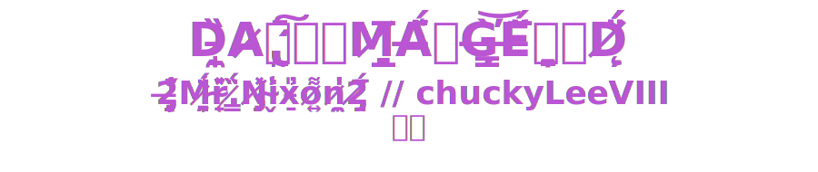
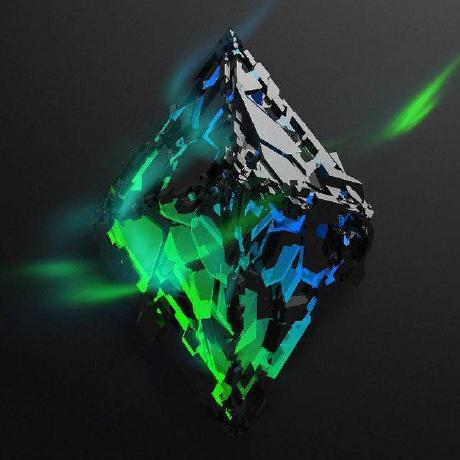

<a id="top"></a>

<!-- ====== HERO ====== -->
<p align="center">
  
</p>

<!-- KINETIC TAGLINE -->
<p align="center">
  
</p>

<!-- CTAs -->
<p align="center">
  <a href="https://github.com/chuckyLeeVIII">
    
  </a>
  <a href="https://github.com/sponsors/chuckyLeeVIII">
    
  </a>
  <a href="mailto:FINESSEANDCOUNTERFITS816@proton.me?subject=Hire%20Me%20%E2%80%94%20Protocol%20%2F%20Solidity%20%2F%20AI">
    
  </a>
</p>

<!-- Social proof -->
<p align="center">
  
  
  
</p>

<!-- Nav -->
<p align="center">
  <a href="#projects">PROJECTS</a> •
  <a href="#wins">LATEST DROPS</a> •
  <a href="#principles">PRINCIPLES</a> •
  <a href="#poly-icons">POLYPY</a> •
  <a href="#stack">STACK</a> •
  <a href="#snapshot">SNAPSHOT</a> •
  <a href="#contact">CONTACT</a>
</p>

<p align="center">
  If this was useful, <a href="https://github.com/chuckyLeeVIII?tab=followers"><b>follow</b></a> and ⭐ the repos you like — it helps a ton.
</p>

<hr>

<!-- ====== PROJECTS ====== -->
<a id="projects"></a>
<p align="center">
  
</p>

| Project                                                                                                                                                      | Why it matters                                                                                                           | Stats                                                                                                                                                                                                                                                                                                                                |
| ------------------------------------------------------------------------------------------------------------------------------------------------------------ | ------------------------------------------------------------------------------------------------------------------------ | ------------------------------------------------------------------------------------------------------------------------------------------------------------------------------------------------------------------------------------------------------------------------------------------------------------------------------------ |
| **[PolyPy](https://github.com/chuckyLeeVIII/PolyPy--a-master-and-universal-guide-and-proof-of-work-to-polly-py-paradigm)**<br/><sub>Master Guide & PoW</sub> | Universal codegen from structured comments. One Python toolchain → generate *web + firmware*. Cut boilerplate, cut bugs. | <br/> |
| **[Agent\_Samantha\_Blackwin](https://github.com/chuckyLeeVIII/Agent_Samantha_Blackwin)**<br/><sub>Local-first AI / OPSEC</sub>                              | Offline RAG with optional SurrealDB; React-Native demo. Privacy-preserving agents for secure edges.                      | <br/>                                                                                                         |
| **[AirForceOne-100-Trustless](https://github.com/chuckyLeeVIII/AirForceOne-100-Trustless)**<br/><sub>Bridge / Pool / Dual-Key / Arbiter</sub>                | Trustless protocol notes with OPSEC docs & scaling. Dual-key flows + safe arbitration.                                   | <br/>                                                                                                     |
| **[DaBlockV6.0](https://github.com/chuckyLeeVIII/DaBlockV6.0)**<br/><sub>Solidity Toolkit & Tests</sub>                                                      | Test-first smart-contract kit for sovereign identity & trustless flows. Clean `src/` & `test/`.                          | <br/>                                                                                                                                 |
| **[AUTO-RBF-BTC-ETH](https://github.com/chuckyLeeVIII/AUTO-RBF-BTC-ETH)**<br/><sub>Satoshi’s Unfinished Code</sub>                                           | Automated replace-by-fee strategies for predictable fee bumps and safer Bitcoin/EVM ops.                                 | <br/>                                                                                                                       |
| **[ai-hedge-fund](https://github.com/chuckyLeeVIII/ai-hedge-fund)**<br/><sub>Agentic Trading Research</sub>                                                  | CLI/Web research stack with Poetry & Docker; optional local models via Ollama.                                           | <br/>                                                                                                                             |


<p align="center">
  <a href="https://github.com/chuckyLeeVIII?tab=repositories&sort=stargazers">→ More projects</a>
</p>

<hr>

<!-- ====== LATEST DROPS ====== -->
<a id="wins"></a>
<h3 align="center">Latest Drops (last 30 days)</h3>
<p align="center">
  🔧 <a href="https://github.com/chuckyLeeVIII/AUTO-RBF-BTC-ETH/commits/main">RBF auto-tuner prototype</a> •
  🧪 <a href="https://github.com/chuckyLeeVIII/DaBlockV6.0/commits/main">New Hardhat test harness for DaBlock</a> •
  🔒 <a href="https://github.com/chuckyLeeVIII/AirForceOne-100-Trustless/commits/main">Dual-key bridge rotation notes</a>
</p>

<hr>

<!-- ====== PRINCIPLES (TABLE) ====== -->
<a id="principles"></a>
<p align="center">
  
</p>

<table align="center">
  <thead>
    <tr>
      <th align="left">Principle</th>
      <th align="left">Description</th>
    </tr>
  </thead>
  <tbody>
    <tr>
      <td>🔒 <b>Trustless by default</b></td>
      <td>Remove implicit trust; verify at protocol boundaries.</td>
    </tr>
    <tr>
      <td>🛡️ <b>Adversarial design</b></td>
      <td>Think like an attacker; ship like a defender.</td>
    </tr>
    <tr>
      <td>🔑 <b>Owner sovereignty</b></td>
      <td>User-controlled keys, data, exits.</td>
    </tr>
    <tr>
      <td>🔍 <b>Auditability</b></td>
      <td>Reproducible deployments; no black boxes.</td>
    </tr>
    <tr>
      <td>⚙️ <b>Simplicity &gt; Complexity</b></td>
      <td>Fewer moving parts, fewer failure modes.</td>
    </tr>
    <tr>
      <td>📈 <b>Raise the bar</b></td>
      <td>Verify, harden, repeat.</td>
    </tr>
  </tbody>
</table>

<hr>


<!-- ====== POLY ICONS / STATEMENT ====== -->
<a id="poly-icons"></a>
<div align="center">
  <p><strong>POLYPY / POLYTHON — "UNIVERSAL PYTHON" PROOF OF WORK</strong><br>
  <em>Structured comments → generate web &amp; firmware targets from one Python toolchain</em></p>
  <p>
    
    
    
    
    
    
    
    
    
    
    
    
    
    
    
    
  </p>
</div>

<hr>

<!-- ====== STACK (ICON STRIP) ====== -->
<a id="stack"></a>
<h3 align="center">Stack</h3>
<p align="center">
  
  
  
  
  
  
  
  
  
  
</p>

<hr>

<!-- ====== SNAPSHOT ====== -->
<a id="snapshot"></a>
<p align="center">
  
  &nbsp;
  
  &nbsp;
  
</p>


<p align="center">
  <br>
  <br>
  
</p>

<hr>

<!-- ====== CONTACT ====== -->
<h3 id="contact" align="center">Contact</h3>
<p align="center"><b>Email:</b> FINESSEANDCOUNTERFITS816@proton.me</p>
<p align="center">
  <sub>No email app? Compose in
    <a href="https://mail.google.com/mail/?view=cm&fs=1&to=FINESSEANDCOUNTERFITS816@proton.me">Gmail</a> ·
    <a href="https://outlook.live.com/mail/0/deeplink/compose?to=FINESSEANDCOUNTERFITS816@proton.me">Outlook</a> ·
    <a href="https://compose.mail.yahoo.com/?to=FINESSEANDCOUNTERFITS816@proton.me">Yahoo</a> ·
    <a href="https://mail.proton.me/u/0/compose?to=FINESSEANDCOUNTERFITS816@proton.me">Proton</a>
  </sub>
</p>

<p align="center">
  <sub>© Cyberpunk Architecture • Trustless by design</sub><br>
  <sub><a href="#top">↑ Back to top</a></sub>
</p>

<!-- Keywords (human-readable) -->
<p align="center">
  <sub>trustless systems • adversarial design • protocol architecture • solidity • local-first AI • python</sub>
</p>
```
